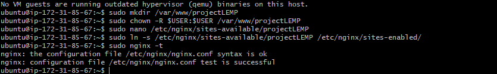

# Project 2 Documentation

## Project-2 LEMP STACK IMPLEMENTATION

`Installing the Nginx Web Server`

`Verify nginx successfully installed and running`

`Confirm Server Running and Accessible locally`

`Test nginx running on internet`

## Installing MYSQL

`Install MYSQL Server`

`login to MYSQL console`

`test login to mysql`

## Installing PHP

`Install php-fpm-mysql`

## Configuring NGINX to Use PHP Processor

`Create root web directory`

`Assign Ownership of the directory`

`Open new Configuration file in Nginx`

`Activate configuration by linking to the config file from Nginx`

`Nginx working confirmation`

## Testing PHP with NGINX

`Create test PHP file in document`

## Retrieving Data from MYSQL Database

`Create a New Database`

`Create a New User and grant access`

`Test if New User has proper permission`

`Insert Content to the Database Table`

`Create PHP Script`

`Access todo list on internet`

`Remove PHP site`

`Reload site`

